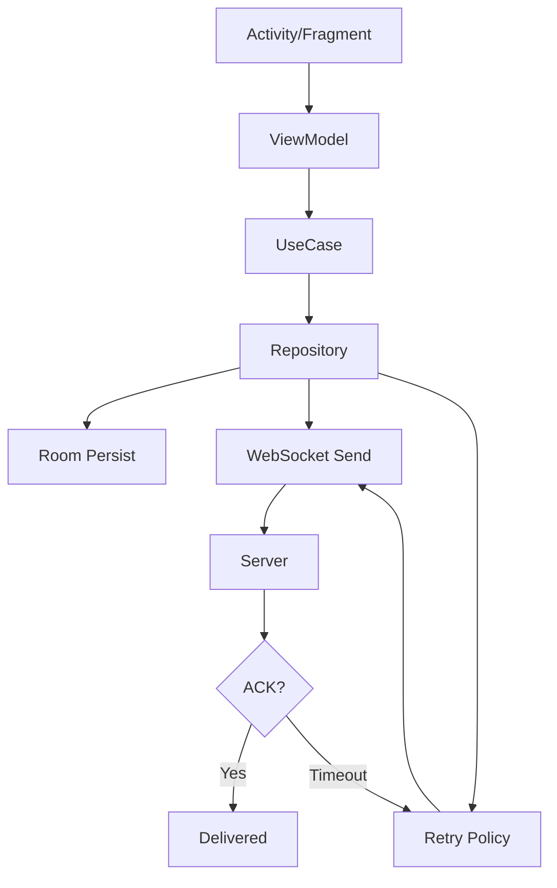

# DaDa IM


Android IM 客户端，聚焦消息可靠性与连接管理。

---

## Screenshots

| 会话列表 | 聊天 | 通讯录 | 朋友圈 | AI 助手 |
|:---:|:---:|:---:|:---:|:---:|
|  |  |  |  |  |

---

## Why This Project

市面上大部分 IM Demo 止步于「消息能收发」。

这个项目多走了一步：消息发出去之后，怎么确认对方收到了？断网了怎么办？App 被杀了重启，消息还在不在？

这些是 IM 工程化的核心问题。

---

## Architecture



```
app
├── domain          — Repository 接口、UseCase、DomainResult
├── core:network    — Retrofit + WebSocket + MessageManager
├── core:database   — Room + MMKV
├── core:common     — 工具、常量、BaseViewModel
├── core:ui         — BaseActivity / BaseFragment
└── core:imageloader — Glide 封装
```

依赖方向单向：`app → domain → core:*`，`core:*` 之间不反向依赖。

---

## Reliability Strategy

这是项目的核心设计。消息投递保证：**At-Least-Once**。

```
Client                          Server
  │                               │
  ├─ Persist (Room, PENDING)      │
  ├─ Send (WebSocket)  ──────────▶│
  │                               ├─ Store
  │                    ◀──────────┤─ ACK
  ├─ Update (DELIVERED)           │
  │                               │
  │  [如果超时未收到 ACK]          │
  ├─ Retry (指数退避)  ──────────▶│
  │  1s → 2s → 4s → 8s → 16s     │
  │  → 30s，最多 6 次             │
  │                               │
  │  [接收端]                      │
  ├─ LRU Dedup (500 条)           │
  └─ Room UNIQUE constraint       │
```

| 层 | 机制 | 解决的问题 |
|----|------|-----------|
| 持久化 | 先写 Room 再发网络 | App 崩溃不丢消息 |
| 确认 | 服务端 ACK 回调 | 网络静默断开时客户端不知道 |
| 重试 | 指数退避，最多 6 次 | 临时网络抖动 |
| 去重 | LRU + UNIQUE 约束 | 重试导致重复投递 |

---

## Engineering Decisions

### 为什么消息先写 Room 再发 WebSocket？

一开始：`send WebSocket → 成功 → insert Room`。问题是 App 崩溃在两者之间，消息就丢了。

改成：`insert Room (PENDING) → send WebSocket → ACK → update Room (DELIVERED)`。消息一定存在于本地。

### 为什么需要 ACK + Retry？

实际测试：WiFi → 4G 切换瞬间，WebSocket `send()` 不抛异常，消息进了 OkHttp 缓冲区，但 TCP 已断。客户端以为发成功了，服务端没收到。

ACK 让客户端确认服务端确实收到；Retry 应对临时抖动；Dedup 保证重试不会重复投递。

### 为什么 WebSocket 要有 HalfOpen 状态？

移动网络经常「假死」——信号满格但几秒发不出去。一超时就断开会产生大量无意义重连。

HalfOpen：超时后不断开，再发一次 ping。pong 回来了 → 连接还活着；还是超时 → 才真正断开。

### 为什么通话要先探测局域网？

TUICallKit 走腾讯云，延迟 50-200ms。同一 WiFi 下 UDP 直连延迟 5-15ms。探测流程约 2-3 秒，对用户透明。

### 为什么用前台 Service 而不是 WorkManager？

WorkManager 最小周期 15 分钟，不适合维持长连接。Foreground Service + `START_STICKY` 在 Android 8+ 后台限制下也能存活。

---

## Capabilities

| 类别 | 功能 |
|------|------|
| 消息 | Text / Image / Voice / Video / File、ACK + 重试、LRU 去重、离线同步、已读回执 |
| 连接 | OkHttp WebSocket、25s 心跳、HalfOpen、前台 Service |
| 音视频 | 局域网 UDP 直连、腾讯云 TUICallKit、自动局域网探测 |
| AI | MiMo API SSE 流式对话、推理过程展示、会话持久化 |
| 推送 | JPush 离线推送 |
| 社交 | 朋友圈图文动态、点赞、评论 |

---

## Documentation

- [Quick Start](docs/quickstart.md) — 环境要求、配置、第三方接入
- [系统架构](docs/系统架构.md) — 模块职责、依赖关系
- [IM 流程](docs/IM流程.md) — 登录、消息流、ACK、重试、推送、通话
- [数据库设计](docs/数据库设计.md) — 表结构、索引
- [Performance](docs/performance.md) — 延迟、内存、恢复时间
- [Evolution](docs/evolution.md) — 版本演进、架构规划

---

## License

For learning and reference purposes only.
