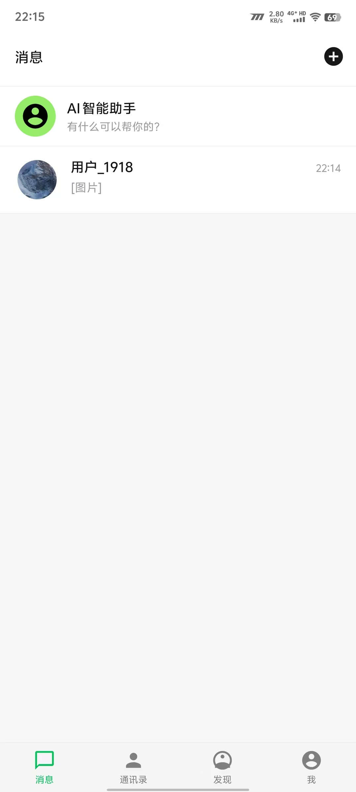
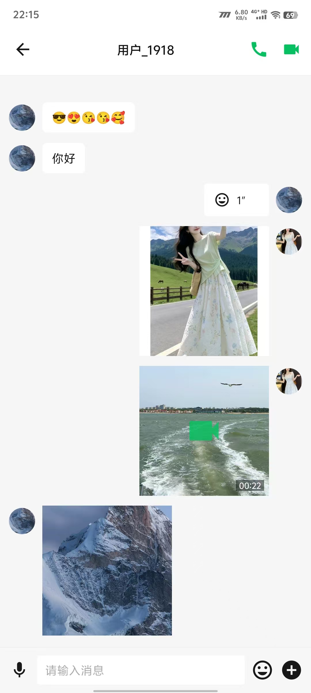
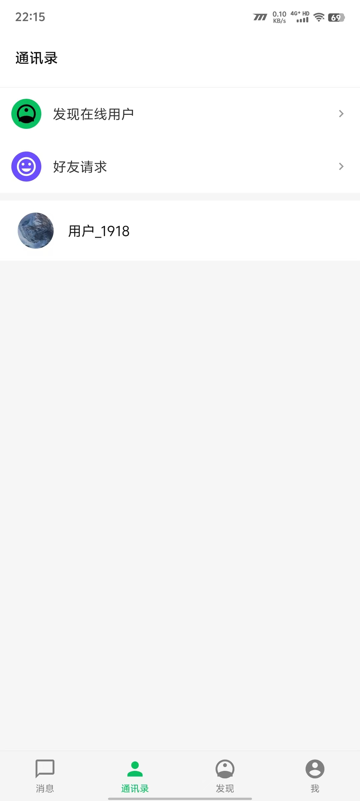
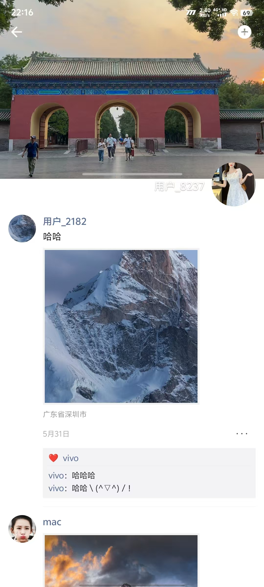
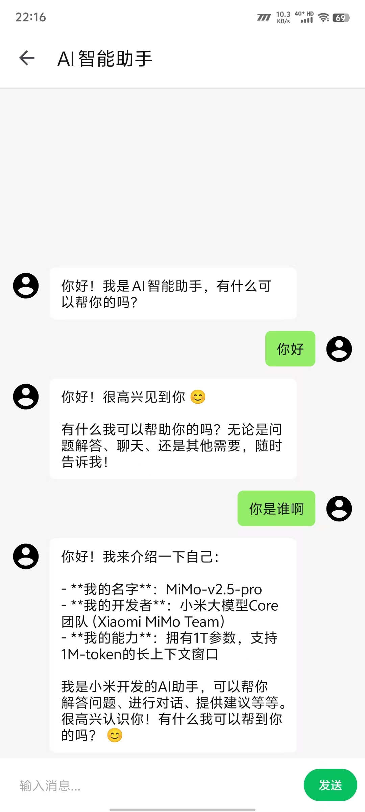
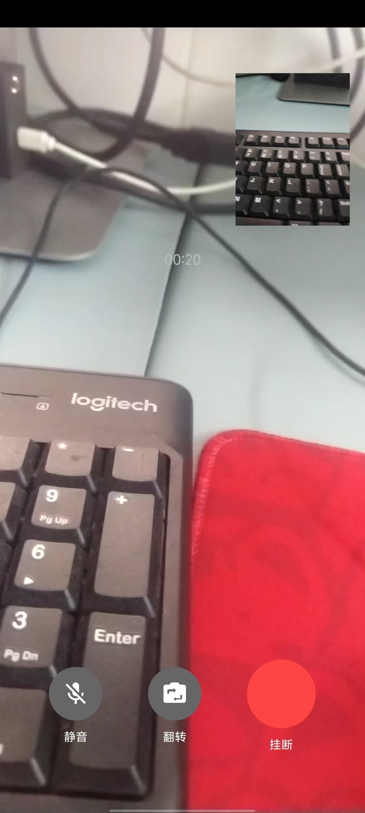

# DaDa IM


基于 Kotlin 的 Android 即时通讯客户端，探索 WebSocket 长连接管理、可靠消息投递、本地持久化、音视频通信、推送集成与多模块 Clean Architecture。

---

## Screenshots

|                              会话列表                         | 聊天 |
|:----------------------------------------------------:|:----------------------------------------------------:|
|  |  |

|                     通讯录                      |                    朋友圈                     |              AI 助手               |
|:--------------------------------------------:|:------------------------------------------:|:--------------------------------:|
|  |  |  |

|                音视频通话                 |
|:------------------------------------:|
|  |

---

## Why This Project

市面上大部分 IM Demo 止步于「消息能收发」。

这个项目想多走几步：消息发出去之后，怎么确认对方收到了？断网了怎么办？App 被杀了重启，消息还在不在？对方不在线，怎么让他知道有新消息？

这些才是 IM 工程化的核心问题。

---

## Core Capabilities

### Messaging

- Text / Image / Voice / Video / File
- ACK confirmation + exponential backoff retry
- LRU dedup (500 entries) + Room UNIQUE constraint
- Offline message sync
- Read receipt

### Connection Management

- OkHttp WebSocket long connection
- 25s heartbeat, 8s timeout
- HalfOpen state + auto reconnect
- Foreground Service (START_STICKY)

### Audio & Video

- LAN UDP direct connection (self-built)
- Tencent Cloud TUICallKit (cloud path)
- Automatic LAN detection before call

### AI Assistant

- MiMo API, SSE streaming
- Reasoning process display
- Conversation persistence

### Push

- JPush offline push
- Foreground Service keepalive

---

## Message Architecture

```
┌──────────┐     ┌──────────┐     ┌──────────┐     ┌──────────┐
│  Sender  │────▶│ViewModel │────▶│ UseCase  │────▶│Repository│
└──────────┘     └──────────┘     └──────────┘     └─────┬────┘
                                                         │
                                            ┌────────────┼────────────┐
                                            ▼            ▼            ▼
                                        ┌──────┐    ┌──────┐    ┌──────┐
                                        │ Room │    │  WS  │    │Retry │
                                        │Persist│   │ Send │    │Policy│
                                        └──────┘    └───┬──┘    └──────┘
                                                        │
                                                        ▼
                                                   ┌──────────┐
                                                   │  Server  │
                                                   └────┬─────┘
                                                        │
                                                    ACK │ Timeout
                                                        ▼
                                                  ┌──────────┐
                                                  │  Update  │
                                                  │  Status  │
                                                  └──────────┘
```

消息发送流程：

1. 先写 Room（status = PENDING）
2. 再发 WebSocket
3. 收到 ACK → 更新为 DELIVERED
4. 超时未收到 → 指数退避重试（1s → 2s → 4s → 8s → 16s → 30s，最多 6 次）
5. 接收端 LRU + UNIQUE 双重去重

---

## WebSocket Lifecycle

```
                     ┌────────────┐
         connect()   │            │   onOpen()
        ┌───────────▶│  CONNECTING │───────────┐
        │            │            │            │
        │            └────────────┘            ▼
 ┌──────────────┐                      ┌────────────┐
 │ DISCONNECTED │◀─────────────────────│  CONNECTED  │
 └──────────────┘   onClose()          └──────┬─────┘
        ▲                                     │
        │           ┌────────────┐            │ heartbeat
        │           │            │  timeout   │ timeout (8s)
        └───────────│  HALF_OPEN │◀───────────┘
         ping fail  │            │
                    └────────────┘
```

心跳每 25 秒发一次。8 秒内没收到 pong → 进入 HalfOpen → 再试一次 ping → 失败则断开 → 自动重连。

`WebSocketService` 以前台 Service 运行，`START_STICKY` 策略，Android 8+ 后台限制下也能存活。

---

## Engineering Decisions

### 为什么消息先写 Room 再发 WebSocket？

一开始的方案：

```
send WebSocket → 成功 → insert Room
```

问题：如果 WebSocket 发送成功，但 insert Room 之前 App 崩溃了，这条消息就丢了——本地没有记录，重连后也不会补。

改成：

```
insert Room (PENDING) → send WebSocket → ACK → update Room (DELIVERED)
```

好处：消息一定存在于本地。即使 App 崩溃、进程被杀，重连后可以从 Room 恢复未发送的消息。

### 为什么需要 ACK + Retry？

最初只依赖 WebSocket 的 `onMessage` 回调判断发送是否成功。

实际测试发现：网络切换瞬间（WiFi → 4G），WebSocket 的 `send()` 不会抛异常，消息进入了 OkHttp 的发送缓冲区，但 TCP 连接已经断了。客户端以为发成功了，服务端根本没收到。

所以加了三层保障：

- **ACK** — 服务端收到后主动回确认，客户端才知道消息确实送达
- **Retry** — 超时未收到 ACK，指数退避重试，应对临时网络抖动
- **Dedup** — 重试会导致服务端收到重复消息，LRU + UNIQUE 约束保证幂等

### 为什么 WebSocket 要有 HalfOpen 状态？

直接断开的问题：移动网络经常出现「假死」——信号显示满格，但实际几秒钟发不出去。如果一超时就断开重连，会产生大量无意义的重连请求。

HalfOpen 的做法：超时后不断开，进入 HalfOpen 状态，再发一次 ping。如果 pong 回来了，说明连接还活着，回到 Connected；如果还是超时，才真正断开。

实测下来，这种方式在地铁、电梯等弱网环境下，在实际测试过程中观察到通常在数秒内恢复。

### 为什么通话要先探测局域网？

TUICallKit 走腾讯云服务器，延迟 50-200ms，且消耗 TRTC 通话时长。但如果两个人在同一个 WiFi 下，UDP 直连延迟可以做到 5-15ms。

探测流程：

1. 通过服务器查询对方的局域网 IP
2. 本机开一个临时 TCP ServerSocket
3. 通过 WebSocket 告诉对方来连
4. 对方尝试 TCP 连接一次
5. 连通 → 同一局域网，走 UDP 直连
6. 超时 → 不在同一网络，走 TUICallKit

整个探测过程约 2-3 秒，对用户透明。

### 为什么用前台 Service 而不是 WorkManager？

WorkManager 的最小周期是 15 分钟，不适合维持 WebSocket 长连接。Foreground Service 可以持续运行，配合 `START_STICKY` 被系统杀死后会自动重启。

代价是通知栏常驻一个通知。这是 Android 8+ 后台限制的必要取舍。

---

## Performance

以下数据在局域网环境下测试（服务端在同一内网）：

### Message Send Delay

| 场景 | 延迟 |
|------|------|
| 局域网 (WiFi) | 15-30ms |
| 公网 (4G) | 50-150ms |

### Database Query

| 操作 | 耗时 |
|------|------|
| 会话列表查询（50 个会话） | < 20ms |
| 单条消息插入 | < 5ms |
| 历史消息加载（20 条） | < 15ms |

### Memory

| 组件 | 占用 |
|------|------|
| LRU 去重缓存 | 500 条消息 ID，约 200KB |
| Room 连接池 | 约 2-3MB |
| WebSocket 连接 | 约 1MB |

### Connection Recovery

| 场景 | 恢复时间 |
|------|---------|
| WiFi → 4G 切换 | 3-5s |
| 进程被杀重启 | 5-8s（前台 Service 重启 + 重连） |
| 服务端重启 | 8-15s（心跳超时 + 重连） |

---

## Project Evolution

```
v1  ─ 单模块，基础聊天
 │    Activity 直接调 API，消息只在内存
 │
v2  ─ 引入 MVVM + Repository
 │    ViewModel 隔离 UI 和数据层
 │    Repository 统一数据来源
 │
v3  ─ Room 持久化
 │    消息写入数据库，App 重启不丢
 │    会话列表、未读计数
 │
v4  ─ WebSocket 长连接
 │    替代轮询，实时消息推送
 │    心跳检测、断线重连
 │
v5  ─ 消息可靠性
 │    ACK 确认机制
 │    指数退避重试
 │    LRU 去重 + UNIQUE 约束
 │
v6  ─ 多模块 Clean Architecture
 │    app / domain / core:network / core:database / core:common
 │    Hilt 依赖注入，面向接口
 │
v7  ─ 推送集成
 │    极光 JPush 离线推送
 │    前台 Service 保活
 │
v8  ─ 音视频
 │    自研 UDP 引擎（局域网）
 │    TUICallKit（云端）
 │    自动局域网探测
 │
v9  ─ AI 助手
 │    MiMo API SSE 流式对话
 │    推理过程展示
 │
v10 ─ 朋友圈
      图文动态、点赞、评论
```

---

## Future Work

以下功能在规划中，当前版本未实现：

### Messaging

- 群聊
- 多设备同步
- 消息搜索
- 端到端加密
- 撤回同步

### Realtime Communication

- WebRTC 替代当前方案
- STUN/TURN 支持
- NAT 穿透
- 自适应码率
- Jitter Buffer
- 丢包恢复
- 回声消除优化

### Media

- 硬件 H264 编码
- 动态丢帧
- 动态分辨率
- 弱网适配

### Architecture

- Jetpack Compose 迁移
- 模块化进一步拆分
- Feature 插件化
- 跨平台探索

### Architecture Evolution

```
Current                              Planned
┌──────────────┐                    ┌──────────────────────────────┐
│  WebSocket   │  ────────────────▶ │  WebSocket (IM channel)      │
│  IM Channel  │                    └──────────────────────────────┘
└──────────────┘
┌──────────────┐                    ┌──────────────────────────────┐
│  UDP (LAN)   │  ────────────────▶ │  WebRTC                      │
│  Voice/Video │                    │  ├─ STUN / TURN              │
└──────────────┘                    │  ├─ Adaptive Bitrate         │
┌──────────────┐                    │  ├─ Jitter Buffer            │
│  TUICallKit  │  ────────────────▶ │  └─ SFU (selective forward)  │
│  Cloud Call  │                    └──────────────────────────────┘
└──────────────┘
```

### Roadmap

- [ ] Group chat
- [ ] Multi-device sync
- [ ] Message search
- [ ] WebRTC migration
- [ ] Adaptive bitrate
- [ ] End-to-end encryption
- [ ] Jetpack Compose
- [ ] Multi-device login

---

## Quick Start

### Requirements

| Tool | Version |
|------|---------|
| JDK | 11+ |
| Android Studio | Arctic Fox (2020.3.1) or later |
| Android SDK | API 24+ (Android 7.0) |
| Gradle | 7.5.1 (wrapper included) |

### Setup

```bash
git clone https://github.com/your-username/DaDaNew.git
cd DaDaNew

# Copy config template
cp gradle.properties.example gradle.properties
```

Edit `gradle.properties`:

```properties
# Required — your backend server
SERVER_BASE_URL=http://your-server-ip:8080
SERVER_WS_URL=ws://your-server-ip:8080

# Optional — JPush (offline push)
JPUSH_APPKEY=your_jpush_appkey_here
JPUSH_CHANNEL=developer-default

# Optional — Tencent Cloud (cloud calls)
TUI_SDK_APP_ID=0
TUI_SECRET_KEY=your_tui_secret_key_here

# Optional — AI Assistant
AI_API_URL=https://api.xiaomimimo.com/v1/chat/completions
AI_MODEL=mimo-v2.5-pro
AI_API_TOKEN=your_ai_api_token_here
```

Open in Android Studio, sync Gradle, run.

### Config Reference

| Key | Required | Without it |
|-----|----------|------------|
| `SERVER_BASE_URL` | Yes | Core chat won't work |
| `SERVER_WS_URL` | Yes | Realtime messaging won't work |
| `JPUSH_APPKEY` | No | No offline push |
| `TUI_SDK_APP_ID` | No | No cloud calls (LAN UDP still works) |
| `AI_API_TOKEN` | No | No AI assistant |

> Only the server address is required for core chat. JPush, TUICallKit, and AI degrade gracefully when unconfigured.

### Demo Mode

If you don't have a backend server yet, the app supports local-only mode for testing UI flows. Login, chat UI, contacts, and moments pages are all navigable.

---

## Documentation

- [项目总览](docs/项目总览.md) — Tech stack, module structure, feature list
- [系统架构](docs/系统架构.md) — Architecture diagram, module responsibilities
- [数据库设计](docs/数据库设计.md) — ER diagram, table schemas, indexing
- [IM 流程](docs/IM流程.md) — Login, message flow, ACK, retry, push, call

---

## Third-Party Setup

### JPush

1. Register at [jiguang.cn](https://www.jiguang.cn/)
2. Create app → get `AppKey`
3. Set `JPUSH_APPKEY` in `gradle.properties`

### Tencent Cloud TUICallKit

1. Register at [cloud.tencent.com](https://cloud.tencent.com/)
2. Enable TRTC → create app → get `SDKAppID` + `SecretKey`
3. Set in `gradle.properties` (or `0` to skip)

### MiMo AI

1. Get token at [api.xiaomimimo.com](https://api.xiaomimimo.com/)
2. Set `AI_API_TOKEN` in `gradle.properties` (or leave empty)

---

## Backend

This repo is the Android client only. The backend needs:

- **REST API** — auth, contacts, message sync, file upload
- **WebSocket** — realtime push at `ws://{host}:8080/ws/{userId}`
- **Push gateway** — JPush server-side SDK for offline push

---

## License

For learning and reference purposes only.
